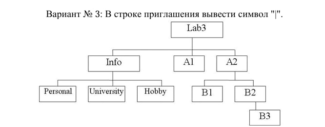
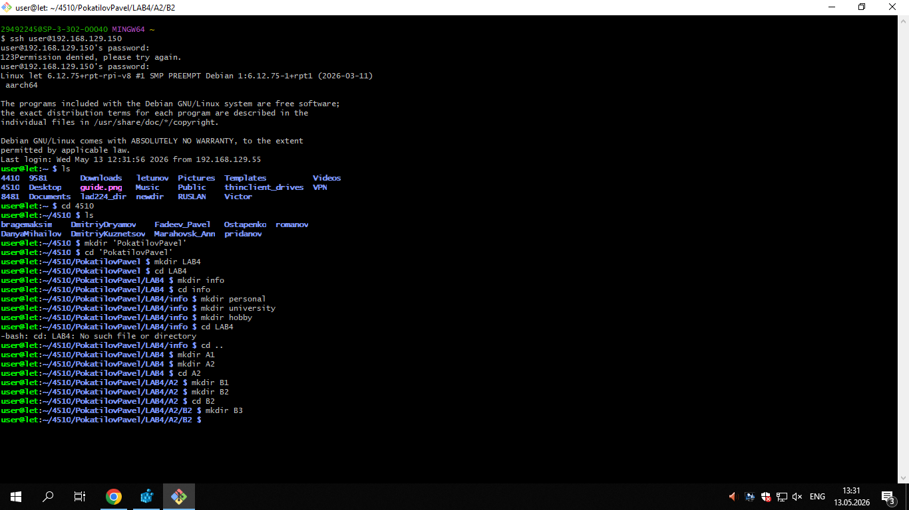

# Лабараторная 4
# Лабораторная работа: Подключение к Raspberry Pi по SSH
# Цель работы
Освоить подключение к Raspberry Pi по SSH и настройку доступа по ключу без пароля.
# Что сделано
1. Подключение к Raspberry Pi
Использована команда:

ssh user@192.168.129.150

После ввода пароля получен доступ к удалённой консоли.
# 2 Работа с каталогами
В корневом каталоге найдена папка группы.
Создан каталог с фамилией студента. Создано дерево каталогов по 1 варианту задания. Команды: cd mkdir

# 3 Завершение подключения
Использована команда:

exit

